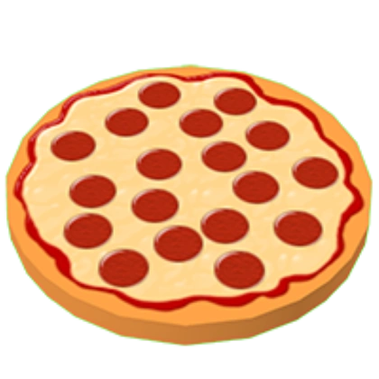
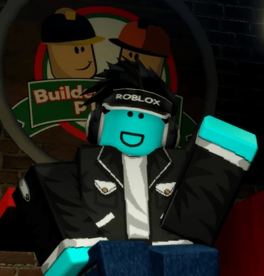

# Site_pizzaria
Esse site foi desenvolvido durante o Projeto Pequenos Talentos 2025 no módulo de desenvolvimento web
Site da pizzaria: https://enzopereira2011.github.io/Site_pizzaroa/

<!DOCTYPE html>
<html lang="pt-br">
<head>
    <meta charset="UTF-8">
    <meta name="viewport" content="width=device-width, initial-scale=1.0">
    <title>Builder Brothers Pizza</title>
</head>
<body>
    <header>
        

            <a>Builder Brothers Pizza</a>
            <nav>
                <a>Cardápio</a>
                <a href=#Sobre>Sobre</a>
                <a>Contato</a>
            </nav>
        

    </header>
    <main>
        <section id="Sobre">
                

                    <h1> Builder Brothers Pizza - Melhor pizzaria de Robloxia!!!</h1>
                    <h1>Sobre:</h1>
                    
Work at a Pizza Place é uma experiência de simulação de trabalho Roblox desenvolvida pela Dued1 em 3 de novembro de 2007 (Observação: diz 28 de março de 2008, mas isso ocorre porque na atualização anterior as datas dos jogos atualizados com frequência eram redefinidas). Originalmente, chamava-se " Work at a Krusty Krab ", mas foi retirado do ar devido a problemas de direitos autorais em algum momento no início e meados de 2008. Em janeiro de 2009, o jogo foi refeito, desta vez chamado de "Work at a Pizza Place". O objetivo do jogo é trabalhar na pizzaria , onde há uma variedade de empregos para obter moedas dos contracheques . Os jogadores podem usar moedas para atualizar suas casas e comprar itens. Há seis empregos que os jogadores podem escolher: Caixa , Cozinheiro , Pizza Boxer , Entregador , Fornecedor e Gerente . Os jogadores podem fazer uma pausa e visitar outras casas, brincar com equipamentos e até viajar para outras ilhas. Eles também podem organizar festas em suas casas na Ilha da Festa . Há também outro edifício chamado The Dump, onde você pode vender e comprar itens com desconto.

                

                <figure>
                    
                </figure>
                <h1>O Criador do Builder Brothers Pizza</h1>
                    <figure>
                        
                <section id="Cardápio">
                    
Cardápio

            <section id="Contato">
                
Contato

        </section>
    </main>
</body>
</html>
